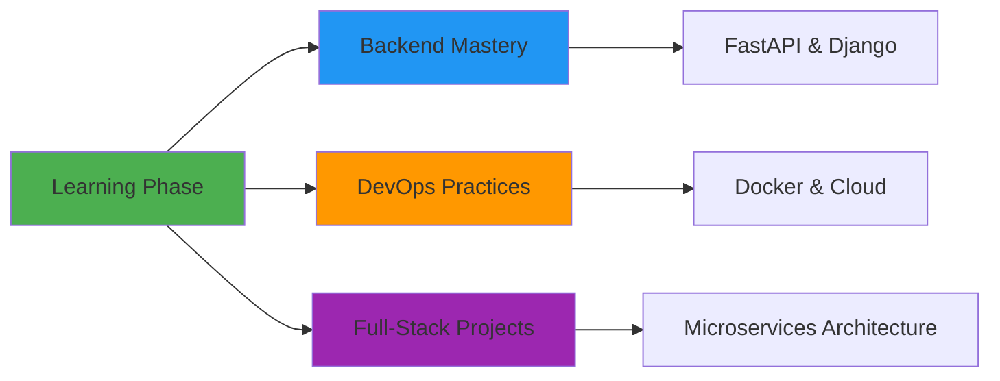
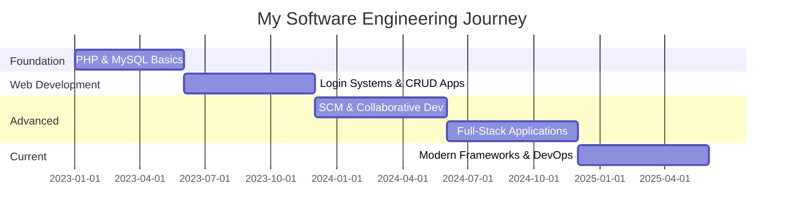
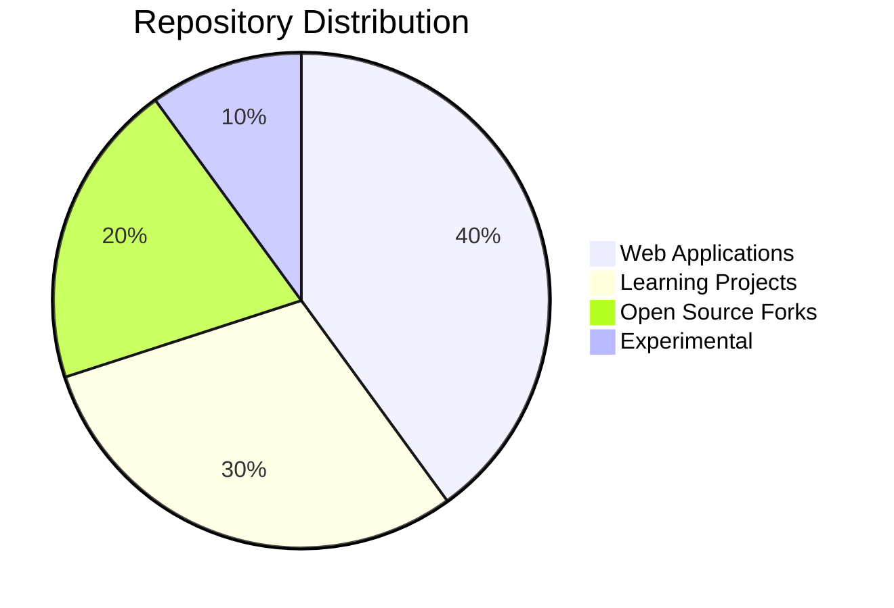
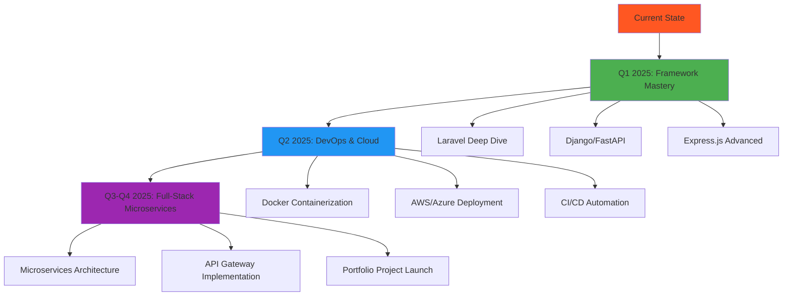
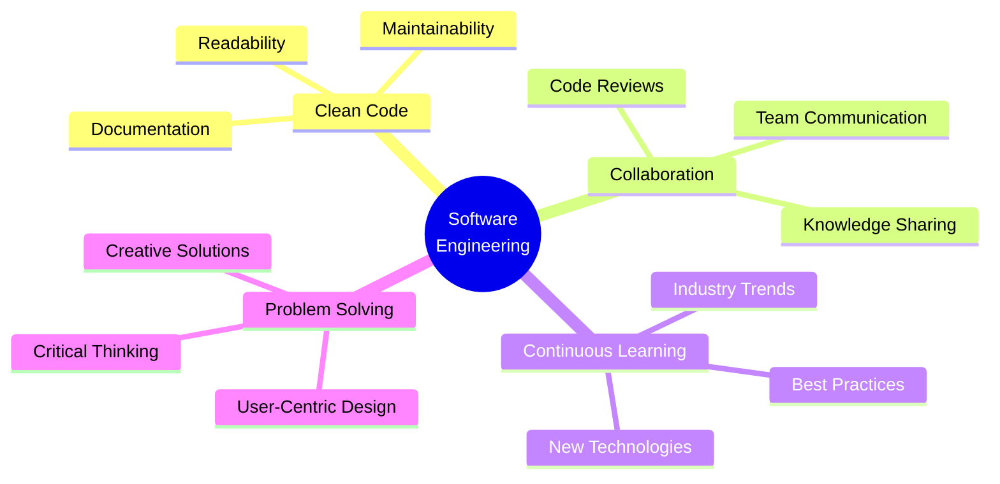

# 👨‍💻 Namidu Hasalanka Kumarasinghe

```ascii
╔══════════════════════════════════════════════════════════════╗
║  Software Engineer | Problem Solver | Continuous Learner    ║
║  BSc (Hons) Software Engineering @ CINEC Campus             ║
╚══════════════════════════════════════════════════════════════╝
```

<div align="center">

**`Building meaningful software, one commit at a time`**

[](mailto:nami.hasalanka@gmail.com)
[](www.linkedin.com/in/namidu-kumarasinghe-943a7a2a2)
[](https://github.com/Namidu99)

</div>

---

## 🌟 Philosophy

> *"Clean code, continuous learning, and collaborative problem-solving are the pillars of impactful software engineering."*

I'm driven by the challenge of transforming complex problems into elegant solutions. Every project is an opportunity to learn, every bug is a lesson, and every collaboration is a chance to grow.

---

## 🎯 Current Focus



- 🔭 Exploring **backend frameworks** (Laravel, Django, FastAPI, Express.js)
- 🐳 Diving into **containerization** and **cloud deployment**
- 🤝 Contributing to **open-source** projects
- 🏗️ Architecting **full-stack microservices** applications

---

## 🛠️ Technology Arsenal

### Frontend Ecosystem
```
HTML5 • CSS3 • JavaScript • React • Bootstrap • Material-UI • Blade Templates
```

### Backend & Databases
```
PHP • Python • Node.js (Express.js) • MySQL • PostgreSQL
```

### DevOps & Tools
```
Git • GitHub • CI/CD Pipelines • Docker (learning) • Linux
```

### Architecture & Practices
```
RESTful APIs • Database Design • MVC Pattern • Version Control • Agile Workflows
```

---

## 📊 Development Journey



---

## 🚀 Featured Projects

### 🎓 Academic & Learning Projects

#### **SCM-Web-App** 
*Software Configuration Management Course Project*
- 📦 **Stack**: PHP, MySQL, Git workflows
- 🎯 **Focus**: Version control best practices, collaborative development, CI/CD pipelines
- 💡 **Key Learning**: Branch management, pull requests, merge conflict resolution

#### **Pharmacy Management System**
*Inventory & Order Management*
- 📦 **Stack**: PHP, Blade Templates, MySQL
- 🎯 **Focus**: CRUD operations, template engines, business logic
- 💡 **Key Learning**: MVC architecture, data relationships, user workflows

#### **Login System with PHP & MySQL**
*My First Full Project*
- 📦 **Stack**: PHP, MySQL
- 🎯 **Focus**: Authentication, session management, security basics
- 💡 **Key Learning**: Form validation, SQL injection prevention, password hashing

### 🔍 Open Source Exploration

#### **HR & Payroll System Analysis**
*Techspase, PrimeX4 Forks*
- 🔬 **Activity**: Studied enterprise-level codebases
- 🎯 **Focus**: Understanding complex architectures, feature implementations
- 💡 **Key Learning**: Enterprise patterns, scalability considerations, integration strategies

---

## 📈 GitHub Activity



<div align="center">

### Stats at a Glance
| Metric | Count |
|:---:|:---:|
| 📦 Public Repositories | 7 |
| ⭐ Stars Earned | 1 |
| 🔱 Forks Created | 3 |
| 👥 Collaborative Projects | Active |

</div>

---

## 🎯 2025 Roadmap



### Short-term Goals (3-6 months)
- ✅ Master **Laravel** or **Django** framework
- ✅ Build and deploy **3 full-stack projects**
- ✅ Complete **Docker & Kubernetes** fundamentals
- ✅ Contribute to **5+ open-source projects**

### Long-term Vision (6-12 months)
- 🎯 Architect a **microservices-based portfolio project**
- 🎯 Achieve **AWS/Azure certification**
- 🎯 Establish regular **OSS contribution** pattern
- 🎯 Mentor junior developers in the community

---

## 💼 Professional Values



- 📖 **Clean Code Advocate**: Writing code that others can understand and maintain
- 🤝 **Collaboration First**: Believing in the power of teamwork and knowledge sharing
- 🎓 **Lifelong Learner**: Staying curious and adaptable in a rapidly evolving field
- 🔧 **Pragmatic Problem Solver**: Balancing theoretical knowledge with practical implementation

---

## 🌐 Tech Stack Proficiency

<div align="center">

| Technology | Proficiency | Experience |
|:---:|:---:|:---:|
| **PHP** | ⭐⭐⭐⭐ | 2+ years |
| **Python** | ⭐⭐⭐ | 1+ year |
| **JavaScript** | ⭐⭐⭐ | 1+ year |
| **React** | ⭐⭐⭐ | Learning |
| **MySQL** | ⭐⭐⭐⭐ | 2+ years |
| **PostgreSQL** | ⭐⭐⭐ | Learning |
| **Git/GitHub** | ⭐⭐⭐⭐ | 2+ years |
| **Docker** | ⭐⭐ | Learning |

</div>

---

## 📫 Let's Connect!

```
┌─────────────────────────────────────────────────┐
│  I'm always open to interesting conversations   │
│  and collaboration opportunities!               │
│                                                 │
│  📧 Email:    nami.hasalanka@gmail.com         │
│  💼 LinkedIn: namidu-kumarasinghe              │
│  🐙 GitHub:   Namidu99                         │
└─────────────────────────────────────────────────┘
```

<div align="center">

### 🎯 Open to:
**Collaboration** • **Open Source** • **Freelance Projects** • **Mentorship** • **Tech Discussions**

---

*"Code is like humor. When you have to explain it, it's bad."* – Cory House

[](https://github.com/Namidu99)

**⭐ If you find my work interesting, consider giving a star to my repositories!**

</div>

---

<div align="center">

```
░█▀▀░█▀█░█▀▄░▀█▀░█▀█░█▀▀░░░█░█░▀█▀░▀█▀░█░█░░░█▀█░█▀█░█▀▀░█▀▀░▀█▀░█▀█░█▀█
░█░░░█░█░█░█░░█░░█░█░█░█░░░█▄█░░█░░░█░░█▀█░░░█▀▀░█▀█░▀▀█░▀▀█░░█░░█░█░█░█
░▀▀▀░▀▀▀░▀▀░░▀▀▀░▀░▀░▀▀▀░░░▀░▀░▀▀▀░░▀░░▀░▀░░░▀░░░▀░▀░▀▀▀░▀▀▀░▀▀▀░▀▀▀░▀░▀
```

</div>
