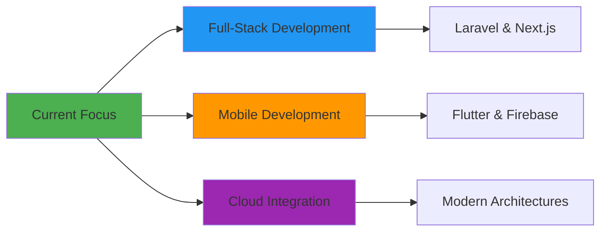
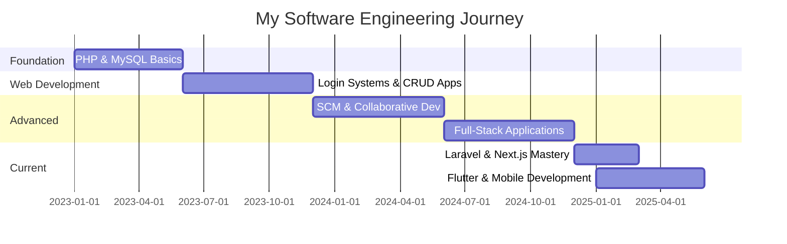
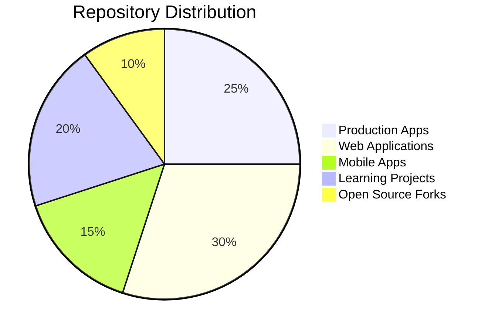
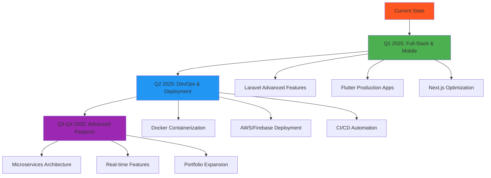
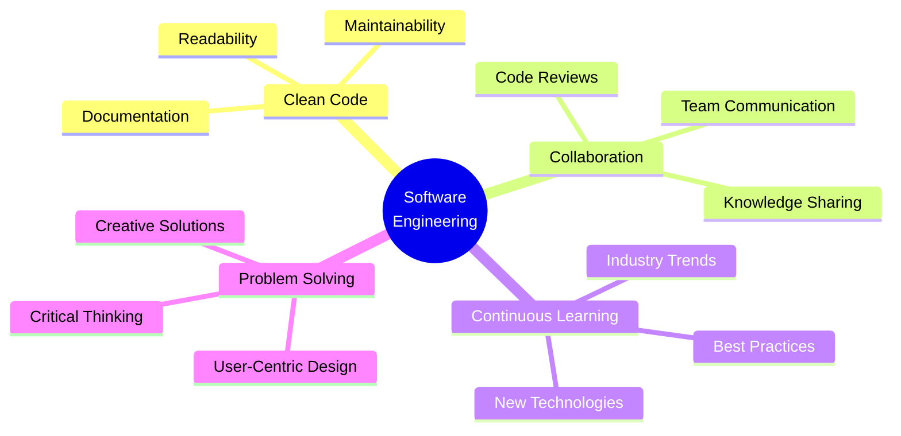

# 👨‍💻 Namidu Hasalanka Kumarasinghe

```ascii
╔══════════════════════════════════════════════════════════════╗
║  Software Engineer | Problem Solver | Continuous Learner    ║
║  BSc (Hons) Software Engineering @ CINEC Campus             ║
╚══════════════════════════════════════════════════════════════╝
```

<div align="center">

**`Building meaningful software, one commit at a time`**

[](mailto:nami.hasalanka@gmail.com)
[](https://www.linkedin.com/in/namidu-kumarasinghe-943a7a2a2/)
[](https://github.com/Namidu99)

</div>

---

## 🌟 Philosophy

> *"Clean code, continuous learning, and collaborative problem-solving are the pillars of impactful software engineering."*

I'm driven by the challenge of transforming complex problems into elegant solutions. Every project is an opportunity to learn, every bug is a lesson, and every collaboration is a chance to grow.

---

## 🎯 Current Focus



- 🔭 Building **production-ready full-stack** applications
- 📱 Developing **cross-platform mobile** solutions with Flutter
- 🔥 Integrating **Firebase** for real-time features
- 🏗️ Architecting **scalable** modern applications

---

## 🛠️ Technology Arsenal

### Frontend Ecosystem
```
HTML5 • CSS3 • JavaScript • React • Next.js • Flutter • Tailwind CSS • Bootstrap • Material-UI
```

### Backend & Databases
```
PHP • Laravel • Python • Node.js (Express.js) • MySQL • PostgreSQL • Firebase • Firestore
```

### Mobile Development
```
Flutter • Dart • Firebase Authentication • Cloud Firestore • Provider State Management
```

### DevOps & Tools
```
Git • GitHub • CI/CD Pipelines • Docker • Linux • Firebase Hosting
```

### Architecture & Practices
```
RESTful APIs • JWT Authentication • Database Design • MVC Pattern • State Management • Responsive Design
```

---

## 🚀 Featured Projects

### 🌟 Production-Level Projects

#### **🛒 Full Stack E-Commerce Web Application** `NEW`
*Complete E-Commerce System with Role-Based Access*
- 📦 **Stack**: Laravel 10, Next.js 14, MySQL, Tailwind CSS
- 🎯 **Features**: 
  - Three-tier user system (Admin, User, Customer)
  - Product management with CRUD operations
  - Shopping cart and customer profiles
  - Advanced search with 4+ filters
  - User privilege management
  - Light/Dark mode toggle
- 💡 **Key Achievements**: 
  - Built scalable REST APIs with Laravel Sanctum
  - Implemented responsive design across all devices
  - Integrated client & server-side validation
  - Dashboard with real-time statistics
- 🔗 **Admin Panel**: `localhost:3000/login`
- 🔗 **Customer Panel**: `localhost:3000/customer/login`

#### **🏠 CampusStay - Smart Rental Finder App** `NEW`
*Mobile App for Students & Professionals*
- 📦 **Stack**: Flutter, Firebase (Auth, Firestore), OpenStreetMap, Provider
- 🎯 **Features**: 
  - Location-based property discovery
  - Interactive map with property markers
  - Real-time chat between landlords & seekers
  - Admin moderation system for listings & reviews
  - Smart onboarding with personalized suggestions
  - Wishlist and submission management
- 💡 **Key Achievements**: 
  - Designed for Sri Lankan campus/workplace transitions
  - Integrated geolocation services
  - Implemented secure Firebase authentication
  - Built admin approval workflow
  - Created role-based access control
- 🌐 **Upcoming**: Multi-language support, visit scheduler, nearby services

---

### 🎓 Academic & Learning Projects

#### **SCM-Web-App** 
*Software Configuration Management Course Project*
- 📦 **Stack**: PHP, MySQL, Git workflows
- 🎯 **Focus**: Version control best practices, collaborative development, CI/CD pipelines
- 💡 **Key Learning**: Branch management, pull requests, merge conflict resolution

#### **Pharmacy Management System**
*Inventory & Order Management*
- 📦 **Stack**: PHP, Blade Templates, MySQL
- 🎯 **Focus**: CRUD operations, template engines, business logic
- 💡 **Key Learning**: MVC architecture, data relationships, user workflows

#### **Login System with PHP & MySQL**
*My First Full Project*
- 📦 **Stack**: PHP, MySQL
- 🎯 **Focus**: Authentication, session management, security basics
- 💡 **Key Learning**: Form validation, SQL injection prevention, password hashing

---

### 🔍 Open Source Exploration

#### **HR & Payroll System Analysis**
*Techspase, PrimeX4 Forks*
- 🔬 **Activity**: Studied enterprise-level codebases
- 🎯 **Focus**: Understanding complex architectures, feature implementations
- 💡 **Key Learning**: Enterprise patterns, scalability considerations, integration strategies

---

## 📊 Development Journey



---

## 📈 GitHub Activity



<div align="center">

### Stats at a Glance
| Metric | Count |
|:---:|:---:|
| 📦 Public Repositories | 9+ |
| ⭐ Stars Earned | Growing |
| 🔱 Forks Created | 3+ |
| 👥 Collaborative Projects | Active |
| 🚀 Production Apps | 2 |

</div>

---

## 🎯 2025 Roadmap



### Short-term Goals (3-6 months)
- ✅ Master **Laravel** and **Flutter** frameworks *(ACHIEVED)*
- ✅ Build and deploy **2 production-ready projects** *(ACHIEVED)*
- 🔄 Complete **Docker & CI/CD** fundamentals
- 🔄 Deploy apps to **AWS/Firebase** cloud platforms
- 🔄 Contribute to **5+ open-source projects**

### Long-term Vision (6-12 months)
- 🎯 Add **payment integration** to e-commerce platform
- 🎯 Launch **CampusStay** to Google Play Store
- 🎯 Build **microservices-based architecture**
- 🎯 Achieve **AWS/Firebase certification**
- 🎯 Mentor junior developers in the community

---

## 💼 Professional Values



- 📖 **Clean Code Advocate**: Writing code that others can understand and maintain
- 🤝 **Collaboration First**: Believing in the power of teamwork and knowledge sharing
- 🎓 **Lifelong Learner**: Staying curious and adaptable in a rapidly evolving field
- 🔧 **Pragmatic Problem Solver**: Balancing theoretical knowledge with practical implementation

---

## 🌐 Tech Stack Proficiency

<div align="center">

| Technology | Proficiency | Experience |
|:---:|:---:|:---:|
| **PHP & Laravel** | ⭐⭐⭐⭐⭐ | 2+ years |
| **Flutter & Dart** | ⭐⭐⭐⭐ | Recent |
| **Next.js & React** | ⭐⭐⭐⭐ | Recent |
| **JavaScript** | ⭐⭐⭐⭐ | 1+ year |
| **Python** | ⭐⭐⭐ | 1+ year |
| **MySQL** | ⭐⭐⭐⭐ | 2+ years |
| **Firebase** | ⭐⭐⭐⭐ | Recent |
| **Git/GitHub** | ⭐⭐⭐⭐ | 2+ years |
| **Docker** | ⭐⭐ | Learning |

</div>

---

## 🏆 Recent Achievements

- ✨ Built a complete **e-commerce platform** with Laravel & Next.js
- 📱 Developed **mobile application** using Flutter & Firebase
- 🔐 Implemented **JWT authentication** and role-based access control
- 🗺️ Integrated **OpenStreetMap** for location-based features
- 🎨 Designed **responsive UI** with light/dark mode support
- 💬 Created **real-time chat** functionality
- 🛡️ Built **admin moderation** systems

---

## 📫 Let's Connect!

```
┌─────────────────────────────────────────────────┐
│  I'm always open to interesting conversations   │
│  and collaboration opportunities!               │
│                                                 │
│  📧 Email:    nami.hasalanka@gmail.com         │
│  💼 LinkedIn: namidu-kumarasinghe              │
│  🐙 GitHub:   Namidu99                         │
└─────────────────────────────────────────────────┘
```

<div align="center">

### 🎯 Open to:
**Collaboration** • **Open Source** • **Freelance Projects** • **Mentorship** • **Tech Discussions**

---

*"Code is like humor. When you have to explain it, it's bad."* – Cory House

[](https://github.com/Namidu99)

**⭐ If you find my work interesting, consider giving a star to my repositories!**

</div>

---

<div align="center">

```
░█▀▀░█▀█░█▀▄░▀█▀░█▀█░█▀▀░░░█░█░▀█▀░▀█▀░█░█░░░█▀█░█▀█░█▀▀░█▀▀░▀█▀░█▀█░█▀█
░█░░░█░█░█░█░░█░░█░█░█░█░░░█▄█░░█░░░█░░█▀█░░░█▀▀░█▀█░▀▀█░▀▀█░░█░░█░█░█░█
░▀▀▀░▀▀▀░▀▀░░▀▀▀░▀░▀░▀▀▀░░░▀░▀░▀▀▀░░▀░░▀░▀░░░▀░░░▀░▀░▀▀▀░▀▀▀░▀▀▀░▀▀▀░▀░▀
```

</div>
