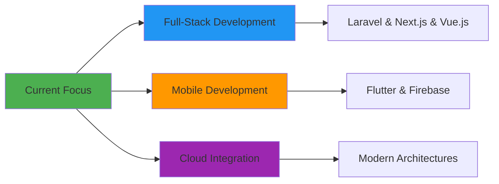
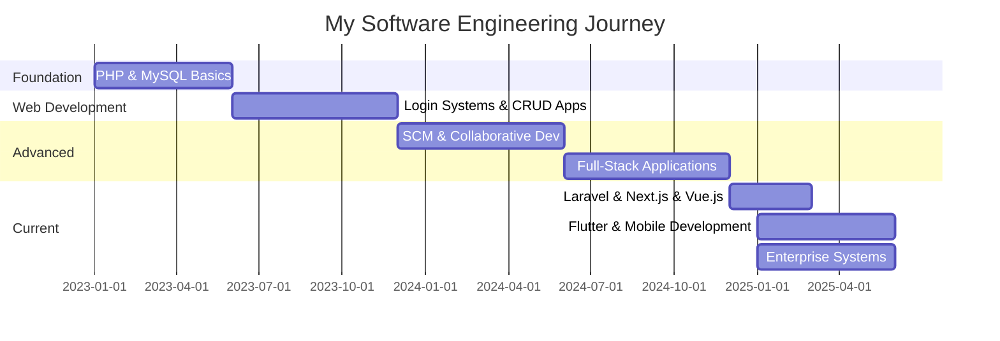
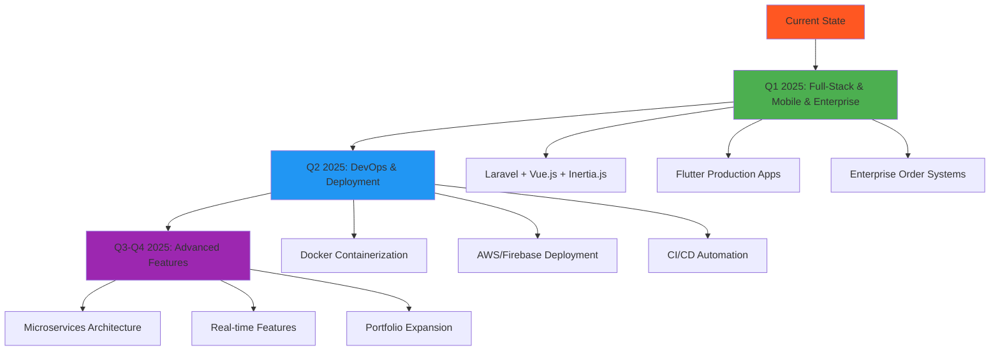
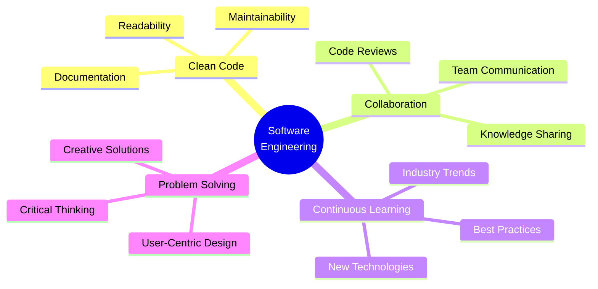

# 👨‍💻 Namidu Hasalanka Kumarasinghe

<div align="center">
  
</div>

<div align="center">

[](mailto:nami.hasalanka@gmail.com)
[](https://www.linkedin.com/in/namidu-kumarasinghe-943a7a2a2/)
[](https://github.com/Namidu99)

</div>

---

## 🌟 Philosophy

> *"Clean code, continuous learning, and collaborative problem-solving are the pillars of impactful software engineering."*

I'm driven by the challenge of transforming complex problems into elegant solutions. Every project is an opportunity to learn, every bug is a lesson, and every collaboration is a chance to grow.

---

## 🚀 About Me

```javascript
const namidu = {
    education: "BSc (Hons) Software Engineering - CINEC Campus",
    location: "Sri Lanka 🇱🇰",
    currentlyBuilding: [
        "Production-ready full-stack applications",
        "Cross-platform mobile solutions with Flutter",
        "Enterprise-grade order management systems"
    ],
    currentlyLearning: [
        "Docker & CI/CD Pipelines",
        "AWS / Firebase Cloud Deployment",
        "Microservices Architecture"
    ],
    availableFor: ["Collaboration", "Open Source", "Freelance Projects", "Mentorship"]
};

console.log("Welcome to my GitHub! Let's build something impactful together 🚀");
```

---

## 🎯 Current Focus



---

## 🛠️ Tech Stack & Tools

<div align="center">

### 🎨 Frontend Development
<p>


</p>

### ⚙️ Backend Development
<p>


</p>

### 🗄️ Databases
<p>


</p>

### 📱 Mobile Development
<p>


</p>

### 🛠️ Tools & DevOps
<p>


</p>

</div>

---

## 🚀 Featured Projects

### 🌟 Production-Level Projects

---

#### **🏢 Enterprise Order Management & Customer Notification System** `NEW`
*Multi-Stage Order Workflow with Real-Time Notifications*

- 📦 **Stack**: Laravel 10, Vue 3, Inertia.js, MySQL, REST APIs
- 🎯 **Key Features**:
  - Multi-step order workflow tracking orders through **6 operational stages** (creation → delivery)
  - Automated customer notification system for real-time status updates at each stage
  - IRM-based order tracking with unique reference generation for audit and traceability
  - Bulk order splitting into multiple invoices based on quantity and dispatch stages
  - Role-based access control (RBAC) with Super Admin, staff roles, and permission-based access
  - Customer and product management modules with relational database design
  - Secure authentication and authorization using **Laravel Breeze + Sanctum**
- 💡 **Highlights**:
  - Modern SPA-style frontend with **Vue 3 + Inertia.js** for smooth, fast UX
  - Scalable MySQL schema supporting orders, invoices, workflow logs, and user permissions
  - Applied MVC architecture, clean code practices, and RESTful design principles

---

#### **🛒 Full Stack E-Commerce Web Application**
*Complete E-Commerce System with Role-Based Access*

- 📦 **Stack**: Laravel 10, Next.js 14, MySQL, Tailwind CSS
- 🎯 **Key Features**:
  - Three-tier user system (Admin, User, Customer)
  - Product management with CRUD operations & advanced search (4+ filters)
  - Shopping cart, customer profiles, and user privilege management
  - Light/Dark mode toggle
- 💡 **Highlights**:
  - Scalable REST APIs with Laravel Sanctum
  - Fully responsive UI across all devices
  - Dashboard with real-time statistics

---

#### **🏠 CampusStay - Smart Rental Finder App**
*Mobile App for Students & Professionals*

- 📦 **Stack**: Flutter, Firebase (Auth, Firestore), OpenStreetMap, Provider
- 🎯 **Key Features**:
  - Location-based property discovery with interactive map & property markers
  - Real-time chat between landlords & seekers
  - Admin moderation system for listings & reviews
  - Smart onboarding with personalized suggestions & wishlist management
- 💡 **Highlights**:
  - Designed for Sri Lankan campus/workplace transitions
  - Integrated geolocation services & Firebase authentication
  - Built admin approval workflow with role-based access control
- 🌐 **Upcoming**: Multi-language support, visit scheduler, nearby services

---

### 🎓 Academic & Learning Projects

#### **SCM-Web-App**
*Software Configuration Management Course Project*
- 📦 **Stack**: PHP, MySQL, Git workflows
- 💡 Branch management, pull requests, merge conflict resolution, CI/CD pipelines

#### **Pharmacy Management System**
*Inventory & Order Management*
- 📦 **Stack**: PHP, Blade Templates, MySQL
- 💡 MVC architecture, data relationships, user workflows

#### **Login System with PHP & MySQL**
*My First Full Project*
- 📦 **Stack**: PHP, MySQL
- 💡 Authentication, session management, form validation, SQL injection prevention

---

## 📊 Development Journey



---

## 🎯 2025 Roadmap



### Short-term Goals (3-6 months)
- ✅ Master **Laravel**, **Flutter**, and **Vue.js** frameworks *(ACHIEVED)*
- ✅ Build and deploy **production-ready projects** *(ACHIEVED)*
- ✅ Build **enterprise-grade** order & workflow systems *(ACHIEVED)*
- 🔄 Complete **Docker & CI/CD** fundamentals
- 🔄 Deploy apps to **AWS/Firebase** cloud platforms
- 🔄 Contribute to **5+ open-source projects**

### Long-term Vision (6-12 months)
- 🎯 Add **payment integration** to e-commerce platform
- 🎯 Launch **CampusStay** to Google Play Store
- 🎯 Build **microservices-based architecture**
- 🎯 Achieve **AWS/Firebase certification**
- 🎯 Mentor junior developers in the community

---

## 🏆 Recent Achievements

- ✨ Built a complete **e-commerce platform** with Laravel & Next.js
- 🏢 Architected an **enterprise order management system** with Vue 3 + Inertia.js
- 📱 Developed **mobile application** using Flutter & Firebase
- 🔔 Implemented **automated notification system** for real-time order tracking
- 🔐 Implemented **RBAC** with Laravel Breeze + Sanctum
- 🗺️ Integrated **OpenStreetMap** for location-based features
- 🎨 Designed **responsive UI** with light/dark mode support
- 💬 Created **real-time chat** functionality

---

## 🌐 Tech Stack Proficiency

<div align="center">

| Technology | Proficiency | Experience |
|:---:|:---:|:---:|
| **PHP & Laravel** | ⭐⭐⭐⭐⭐ | 2+ years |
| **Vue.js & Inertia.js** | ⭐⭐⭐⭐ | Recent |
| **Flutter & Dart** | ⭐⭐⭐⭐ | Recent |
| **Next.js & React** | ⭐⭐⭐⭐ | Recent |
| **JavaScript** | ⭐⭐⭐⭐ | 1+ year |
| **Python** | ⭐⭐⭐ | 1+ year |
| **MySQL** | ⭐⭐⭐⭐ | 2+ years |
| **Firebase** | ⭐⭐⭐⭐ | Recent |
| **Git/GitHub** | ⭐⭐⭐⭐ | 2+ years |
| **Docker** | ⭐⭐ | Learning |

</div>

---

## 📫 Let's Connect!

<div align="center">


**📧 Email**: [nami.hasalanka@gmail.com](mailto:nami.hasalanka@gmail.com)
**💼 LinkedIn**: [namidu-kumarasinghe](https://www.linkedin.com/in/namidu-kumarasinghe-943a7a2a2/)
**🐙 GitHub**: [Namidu99](https://github.com/Namidu99)

### 🎯 Open to:
**Collaboration** • **Open Source** • **Freelance Projects** • **Mentorship** • **Tech Discussions**

</div>

---

## 💼 Professional Values



---

<div align="center">

**💫 "Code is like humor. When you have to explain it, it's bad."** – Cory House

[](https://github.com/Namidu99)

**⭐ If you find my work interesting, consider giving a star to my repositories!**

</div>
