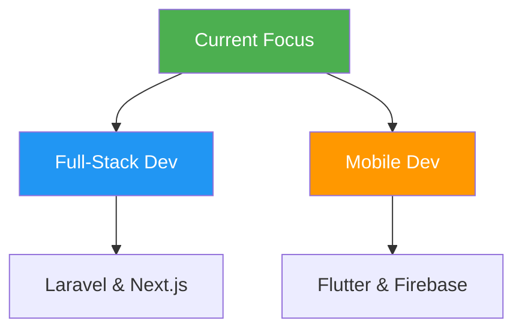

# Hi there! 👋 I'm Namidu Hasalanka Kumarasinghe


<div align="center">
  
</div>

<div align="center">

[](mailto:nami.hasalanka@gmail.com)
[](https://www.linkedin.com/in/namidu-kumarasinghe-943a7a2a2/)
[](https://github.com/Namidu99)
[](https://github.com/Namidu99)

</div>

---


## 🚀 About Me

```javascript
const namidu = {
    role: "Software Engineer & Problem Solver",
    education: "BSc (Hons) Software Engineering - CINEC Campus",
    location: "Sri Lanka 🇱🇰",
    philosophy: "Clean code, continuous learning, and collaborative problem-solving.",
    currentlyBuilding: [
        "Production-ready full-stack applications",
        "Cross-platform mobile solutions with Flutter",
        "Enterprise-grade order management systems"
    ],
    currentlyLearning: [
        "Docker & CI/CD Pipelines",
        "AWS / Firebase Cloud Deployment",
        "Microservices Architecture"
    ],
    availableFor: ["Collaboration", "Open Source", "Freelance Projects", "Mentorship"]
};

console.log("Welcome to my GitHub! Let's build something impactful together 🚀");

```

<br clear="right"/>

* 🔭 Currently working on **Enterprise Order Management Systems** and **Full-Stack E-Commerce**
* 🌱 Learning **Cloud Architecture (AWS/Firebase)** and **DevOps**
* 👯 Looking to collaborate on **Open Source** and **Innovative Tech Solutions**
* 📫 Reach me at **nami.hasalanka@gmail.com**

---


## 🐍 Contribution Snake

<div align="center">
<picture>
<source media="(prefers-color-scheme: dark)" srcset="https://www.google.com/search?q=https://raw.githubusercontent.com/Namidu99/Namidu99/output/github-contribution-grid-snake-dark.svg">
<source media="(prefers-color-scheme: light)" srcset="https://www.google.com/search?q=https://raw.githubusercontent.com/Namidu99/Namidu99/output/github-contribution-grid-snake.svg">

</picture>
</div>

---


## 🛠️ Tech Stack & Tools

<div align="center">

### 🎨 Frontend Development

<p>


</p>

### ⚙️ Backend Development

<p>


</p>

### 🗄️ Databases

<p>


</p>

### 📱 Mobile Development

<p>


</p>

### 🛠️ Tools & DevOps

<p>


</p>

</div>

---


## 📊 GitHub Statistics

<div align="center">

</div>

---

<div align="center">

</div>

<div align="center">

</div>

---

<div align="center">

</div>

<div align="center">


</div>

<div align="center">


</div>

---


## 🚀 Featured Projects

### 🌟 Production-Level Projects

#### **🏢 Enterprise Order Management & Customer Notification System** `NEW`

*Multi-Stage Order Workflow with Real-Time Notifications*

* 📦 **Stack**: Laravel 10, Vue 3, Inertia.js, MySQL, REST APIs
* 🎯 **Key Features**: Multi-step order workflow (6 stages), Automated notifications, IRM tracking, Bulk invoice splitting, RBAC (Super Admin/Staff).

#### **🛒 Full Stack E-Commerce Web Application**

*Complete E-Commerce System with Role-Based Access*

* 📦 **Stack**: Laravel 10, Next.js 14, MySQL, Tailwind CSS
* 🎯 **Key Features**: Three-tier user system, Product CRUD, Shopping cart, Dashboard analytics, Sanctum API auth.

#### **🏠 CampusStay - Smart Rental Finder App**

*Mobile App for Students & Professionals*

* 📦 **Stack**: Flutter, Firebase (Auth, Firestore), OpenStreetMap
* 🎯 **Key Features**: Location-based discovery, Real-time chat, Admin moderation, Smart onboarding.

---


## 🎯 Current Focus & Roadmap

<div align="center">



</div>

### 2025 Goals

* 🔄 Complete **Docker & CI/CD** fundamentals
* 🔄 Deploy apps to **AWS/Firebase** cloud platforms
* 🔄 Contribute to **5+ open-source projects**
* 🎯 Launch **CampusStay** to Google Play Store

---


## 🎭 Professional Values & Fun Facts

<div align="center">

```javascript
const namiduFacts = {
    favoriteStack: "Laravel + Vue.js + Flutter 💙",
    codeEditor: "VS Code (Dark Mode always) 🌑",
    debuggingMethod: "Rubber Duck Debugging & Coffee ☕",
    values: ["Clean Code", "Collaboration", "Impact"],
    hobbies: ["Tech Research", "Gaming", "Problem Solving"]
};

console.log("Code is like humor. When you have to explain it, it's bad.");

```

</div>

---

<div align="center">


**📧 Email**: [nami.hasalanka@gmail.com](mailto:nami.hasalanka@gmail.com)
**💼 LinkedIn**: [namidu-kumarasinghe](https://www.linkedin.com/in/namidu-kumarasinghe-943a7a2a2/)

</div>


```

### ⚠️ Important Step for the Snake Animation
The "Contribution Snake" (the snake eating your commit squares) requires a **GitHub Action** to actually generate the image. Without this, the image will be broken.

1.  Create a folder in your repo: `.github/workflows`
2.  Create a file inside it named `snake.yml`
3.  Paste this code inside `snake.yml`:

```yaml
name: Generate Snake

on:
  schedule:
    # every 6 hours
    - cron: "0 */6 * * *"
  workflow_dispatch:

jobs:
  build:
    runs-on: ubuntu-latest
    steps:
      - uses: actions/checkout@v2
      
      - uses: Platane/snk@v2
        id: snake-gif
        with:
          github_user_name: Namidu99
          outputs: |
            dist/github-contribution-grid-snake.svg
            dist/github-contribution-grid-snake-dark.svg?palette=github-dark

      - uses: crazy-max/ghaction-github-pages@v2.1.3
        with:
          target_branch: output
          build_dir: dist
        env:
          GITHUB_TOKEN: ${{ secrets.GITHUB_TOKEN }}

```
